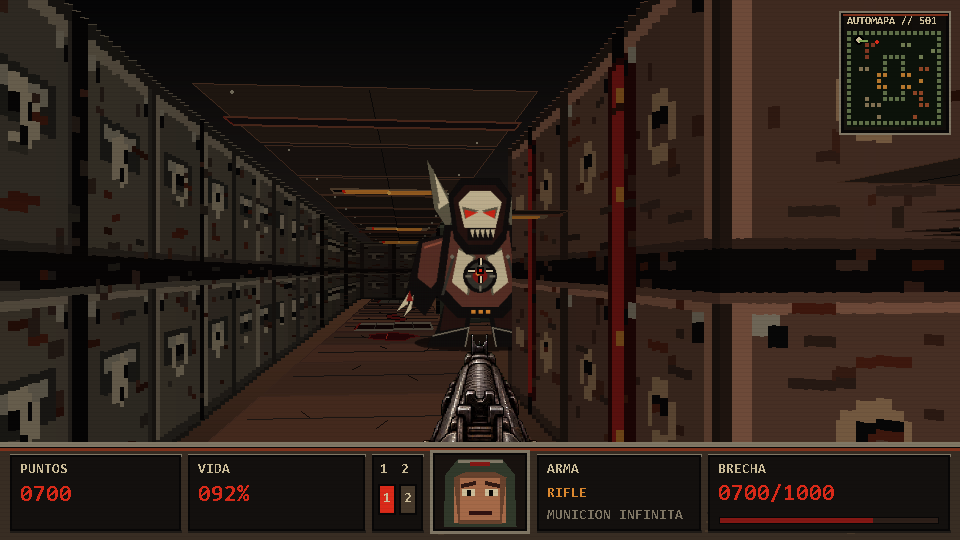

# Neon Breach

Raycaster didáctico en Python y Pygame, con mapa 2D, proyección 2.5D,
enemigos con navegación, armas, oclusión por profundidad y escenas educativas
que muestran cómo se construye el pipeline paso a paso.



## Requisitos

- Python 3.10 o posterior
- Pygame 2.6.1
- NumPy 2.x

Instala las dependencias con:

```powershell
python -m pip install -r requirements.txt
```

## Ejecutar

```powershell
python main.py
python main.py --sin-hud
python main.py --pantalla-completa
```

En Windows también puedes usar `ejecutar.bat`.

Controles principales: `WASD` para moverte, ratón o flechas para girar,
clic izquierdo o `Espacio` para disparar, `1` y `2` para cambiar de arma,
`R` o `Enter` para iniciar/reiniciar, `F11` para pantalla completa y `Esc`
para volver al menú.

## Estructura

- `main.py`: bucle principal, entrada y estados del juego.
- `entities.py`: jugador, enemigos, movimiento y colisiones.
- `raycasting.py`: recorrido DDA y distancias de las paredes.
- `renderer.py`: dibujo del mundo, enemigos, armas y HUD.
- `map_data.py`: mapa y puntos de aparición.
- `settings.py`: constantes de juego y renderizado.
- `audio.py`: efectos de sonido con respaldo procedural.
- `etapas/`: escenas introductorias independientes.
- `fases/`: escenas y experimentos del proceso de desarrollo.

## Audio y videos

Los MP3 y los videos de trabajo no se incluyen en la publicación por defecto:
su licencia no está documentada y algunos archivos son materiales de
producción. El juego funciona sin ellos gracias a los sonidos procedurales de
`audio.py`. Si cuentas con una licencia de redistribución, puedes colocar los
efectos localmente en `assets/audio/` sin modificar el código.

## Derechos de los recursos

El código y los recursos visuales deben revisarse por separado antes de
publicarlos o reutilizarlos. No se añade una licencia automática a este
repositorio para no otorgar derechos sobre binarios cuyo origen o licencia aún
deba confirmarse. Añade una licencia explícita cuando hayas decidido qué
material puede redistribuirse.

## Pruebas

```powershell
python pruebas_logica.py
python -m py_compile main.py renderer.py entities.py raycasting.py
```
